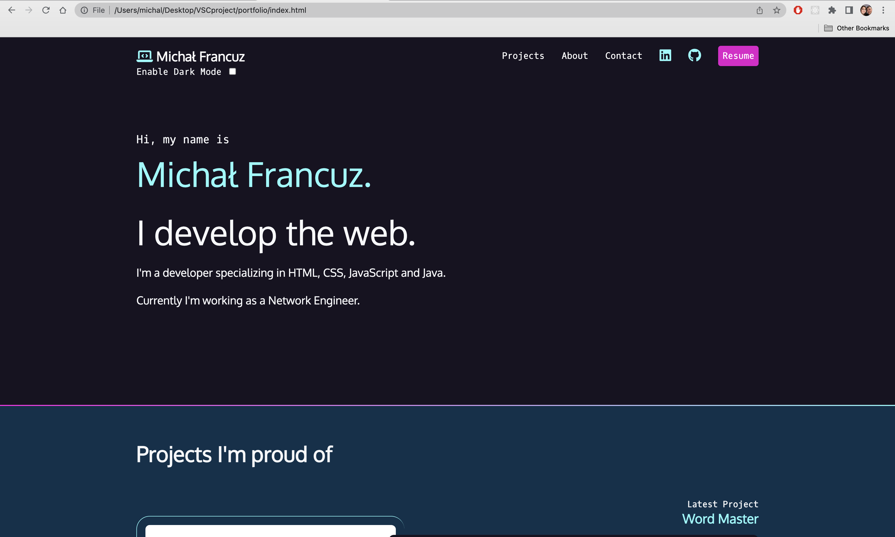
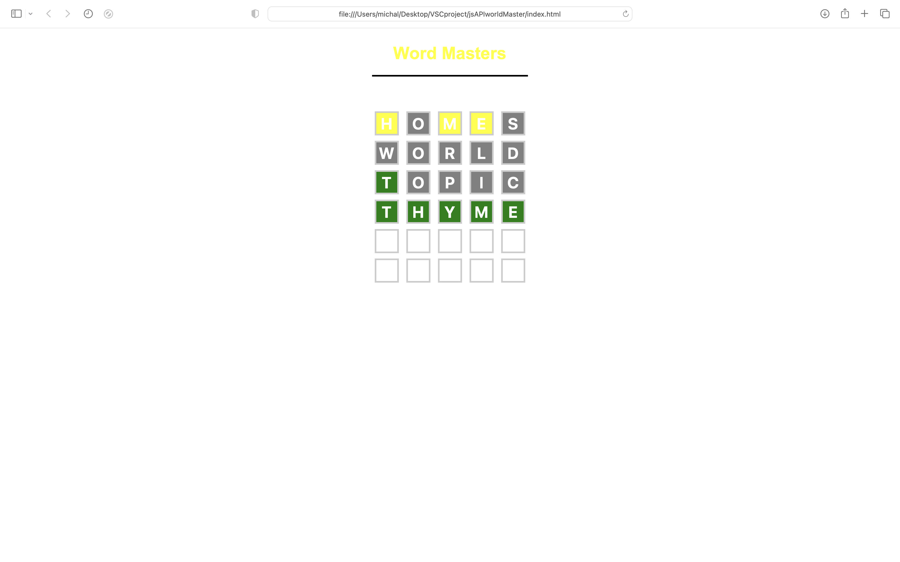
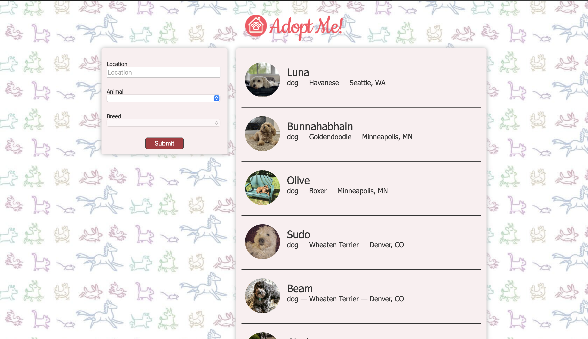

### Hi there! 👋

I'm Michał, student on last year of bachelor degree - computer science in <a href="https://wsb.edu.pl/uczelnia/aktualnosci/akademia-wsb-na-podium-rankingu-szkol-wyzszych-perspektywy-2022.html" target="_blank" rel="noopener noreferrer"> Akademia WSB</a>. My skills: HTML, CSS, JavaScript, Java and Kotlin. Now I focus on learning React. My goal is to develop full response web apps and multi-tab websides. I was previously working as computers networks assembler and now as network engineer. For me learning of programming is like a hobby. I like coding in frontend becaouse I can see immediately effect of my work. Next great technology for me is programming language Ruby. Everything I learning myself. My interesting is traveling, watching good serials as well as movie and reading about new technology.

<a href="https://www.linkedin.com/in/micha%C5%82-francuz-45499a110/" target="_blank" rel="noopener noreferrer"> My LinkedIn </a>

<a href="https://stupendous-paletas-ce646d.netlify.app/" target="_blank" rel="noopener noreferrer"> My Portfolio Website </a>

My learning source: <a href="https://frontendmasters.com/dashboard" target="_blank" rel="noopener noreferrer"> FrontendMasters </a>, <a href="https://codegym.cc/quests" target="_blank" rel="noopener noreferrer"> Code Gym</a>. 

🧩 What I have already learned:
 🚀 basic of JavaScript (DOM, Object Methods, Arrow Functions, using APIs, Async Function, Modules),
 🚀 HTML,
 🚀 CSS,
 🚀 basic of Java and JavaFX (classes, data structures, inheritance, exception handling, swing).

👨‍💻 What I’m currently learning:
 🚀 React.js.

🎯 My goals:
 🚀 my first internship as frontend developer,
 🚀 my first group of clients for develop websites for them.

My JavaScript projects:

  
React's project for learning:

<!--
**MichalFrancuz/MichalFrancuz** is a ✨ _special_ ✨ repository because its `README.md` (this file) appears on your GitHub profile.

Here are some ideas to get you started:

- 🔭 I’m currently working on ...
- 🌱 I’m currently learning ...
- 👯 I’m looking to collaborate on ...
- 🤔 I’m looking for help with ...
- 💬 Ask me about ...
- 📫 How to reach me: ...
- 😄 Pronouns: ...
- ⚡ Fun fact: ...
-->
